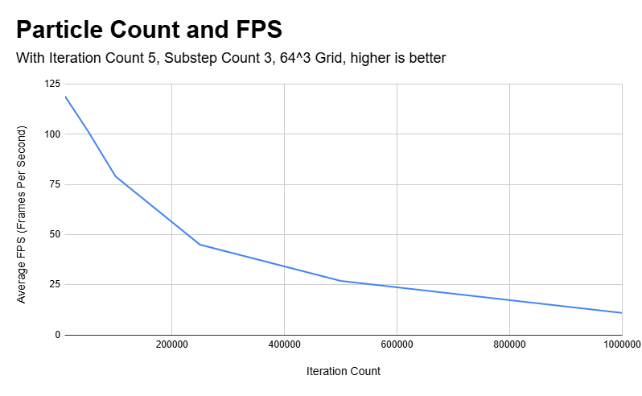
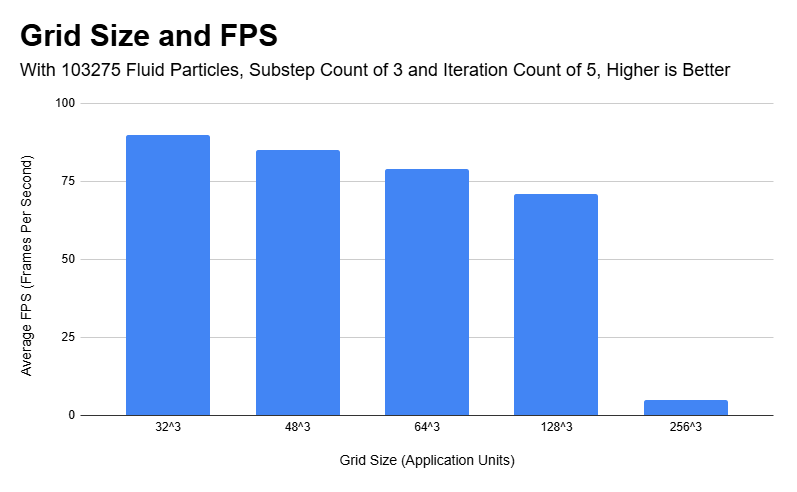
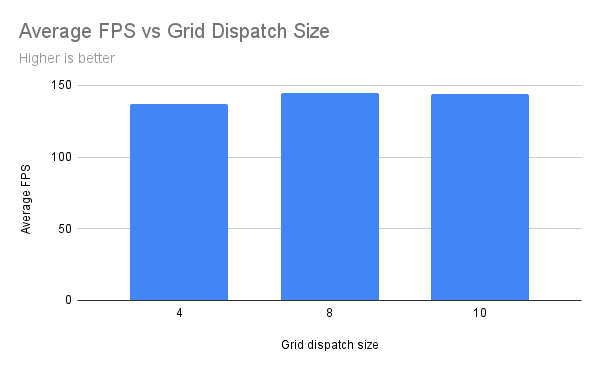

Breakpoint is a project created by Daniel Gerhardt, Dineth Meegoda, Matt Schwartz, and Zixiao Wang. The goal is to combine PBMPM, a recent particle simulation method created by EA with fluid mesh shading using another 2024 research paper so as to make the simulation work in real time. 

Initially our plan was to incorporate the Mesh Mortal Kombat paper for the voxelization and destruction of soft bodies using PBMPM particles, but the scope of the project became too large.

# Milestone Overviews

## Milestone 1

The largest development for milestone 1 was the creation of the DirectX 12 engine. The project was created from scratch, so a lot of time and effort went in to putting together a solid foundation for the rest of the project that could scale for the many pipelines and compute passes required for combing PBMPM with mesh shading fluids. Additionally, compute passes, structured buffers for GPU data passing, and initial mesh shaders were set up for this milestone.

[Presentation Slides: Milestone 1](https://docs.google.com/presentation/d/1uvDaPuCbTf3sGTrdG3B5cbSMfCqcLp-30cOSEHXo5kk/edit?usp=sharing)

## Milestone 2

During milestone 2, PBMPM and PBD were implemented. PBMPM in 2D had some issues, mainly with volume loss and grid managemement, since the grid was not properly scaled for the camera setup. PBD was implemented with face and distance constraints for voxels, but after this milestone the work was sidelined to focus on getting PBMPM set up for 3D. The compute passes for mesh fluid shading were also created, and many optimizations were added to ensure the speed and optimality of the rendering of the fluids. 

[Presentation Slides: Milestone 2](https://docs.google.com/presentation/d/13KYH3RUm3WJH41AbbYVSyAzI5QF6jys8uZgEHLffQEA/edit?usp=sharing)

## Milestone 3

For milestone 3, the 3D framework for PBMPM was created. Additionally emission and dynamic forces were added to the implementation of PBMPM, which aided in the fix for the grid bug present in milestone 2. The framework for mesh shading the fluids was completed, so all of the pieces for the finished product are in place. The setback is that there are issues with the movement of the 3D particles, and the mesh shading fluid setup needs to be adapted to have PBMPM particles as their input, which are the next steps for the project.

[Presentation Slides: Milestone 3](https://docs.google.com/presentation/d/10rVP-IElwPZj0ps3fi2w58sSem8OLQtoXfR4WyeSV_s/edit?usp=sharing)

## TODOs for Final Presentation

The last steps for the final week of the project are as follows.
- Fix volume loss and noise in 2D PBMPM
- Fix force application and up-right movement in 3D PBMPM
- Adapt fluid mesh shading to take liquid PBMPM particles as input
- Build a demo scene

# Project Overview

## DirectX Core

The DirectX core for this project is the rendering and compute framework for all the presentation and computation of the project. It was created from scratch, with help from the DX documentation, examples, and Ohjurot's tutorial series. The core includes a scene with render pipelines for mesh objects, PBMPM particles, and the fluid mesh shading pipelines. It has a movable camera for traversal through the scene, and mouse interaction to apply forces to the PBMPM particles. There are custom StructuredBuffer and DescriptorHeap classes to better interface with the DirectX API for our uses, making it easier for us to create and manage memory on the GPU. We also used ImGUI for parameter tuning in PBMPM.

## PBMPM

The public repository for PBMPM includes a 2D, non-optimized version of the simulation. We hope to expand this to 3D, and add shared memory GPU optimizations to PBMPM to make it real time in DirectX. We have had trouble setting up the grid to play well with our camera and object scale as well as volume preservation, and moving to 3D has caused some further issues with particle movement.

PBMPM works by putting particles into a grid of bukkits, allocating work per bukkit, and then enforcing movement constraints per material per bukkit. The bukkits have a halo range so the particles can react to the movement of particles within neighboring bukkits.

As of milestone 3 the 2D implementation has working bukkiting, mouse movement for forces, and sand, snow, and liquid materials. In 2D gravity is applied and particles interact, but volume loss and noise are prevalent in the system. In 3D, the forces are not applied properly, and there is an unknown bug causing the particles to move up and to the right.

## Fluid Mesh Shading

We use a novel approach for constructing the fluid surface's polygonal mesh, via a GPU-accelerated marching cubes algorithm that utilizes mesh shaders to save on memory bandwidth. The specific approach follows [this paper](https://dl.acm.org/doi/10.1145/3651285), which introduces a bilevel uniform grid to scan over fluid particles from coarse-to-fine in order to build a density field, and then runs marching cubes per-cell, but in reference to the coarse groupings in order to save on vertex duplication.

As of milestone 2, we still have a few bugs to work out in the 6-compute pass (+ mesh shading pass) implementation. But we're very, *very* close! One complete, we can show off our implementation by loading in the particle position data from alembic files in the paper's github repository. Finally, we can use this fluid mesh shading technique to render the PBMPM-simulated fluid.

In the course of implementing this paper, we found many opportunities for significant performance improvements based on principle concepts taught in CIS 5650. To name a few, without going into too much detail:
1. The paper iterates over 27 neighboring cells in each thread, while constructing the uniform grid, but via complex flow-control logic, eliminates all but 8. We found a more efficient way to iterate over those 8 neighbors directly.
2. In two compute passes, the paper uses an atomic operation per thread to compact a buffer. This can be done more efficiently via stream compaction. Rather than a prefix-parallel scan, we opted to use a wave-intrinsic approach that limits atomic use to 1-per-wave.
3. In one of the more expensive compute passes, the paper again iterates over neighbors and performs many expensive global memory accesses in doing so. We implemented a shared-memory optimization to remove redundant global access.
4. Rather than resetting buffers via expensive memcpy, we are using compute shaders to reset them, avoiding the CPU-GPU roundtrip cost.
5. The paper uses one-dimensional compute dispatches; this necessitates the use of expensive modular arithmetic to calculate indices and can be avoided with three-dimensional dispatch.
7. And an assortment of smaller optimizations and fixes to undefined behavior used in the paper.

## PBD Voxelization

The Mesh Mortal Kombat paper focuses on using PBD particles to seperate a mesh into pieces that can break apart like a realistic soft body. This works by enforcing distance constraints within the voxels and face to face constraints between them. We initially wanted to use PBMPM particles to cause the destruction of the soft body materials. However, as the project progressed and we hit milestone 2, we realized it was not realistic to get a working PBMPM and PBD integration. This is largely caused because there is not much detail on the math behind the constraints and approach used for the soft body destruction. We decided it was best to focus our time on a solid PBMPM rendering rather than trying to work out the details of the soft body destruction.

# Performance Review

## PBMPM

## Fluid Mesh Shading

Helpful resources: 
- [PBMPM](https://www.ea.com/seed/news/siggraph2024-pbmpm)
- [Fluid Mesh Shading](https://dl.acm.org/doi/10.1145/3651285)
- For the DX12 basics and compointer class, we used this great tutorial series resource: https://github.com/Ohjurot/D3D12Ez
